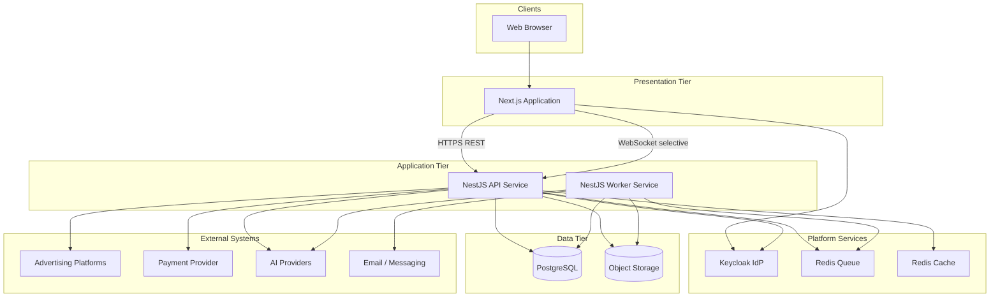
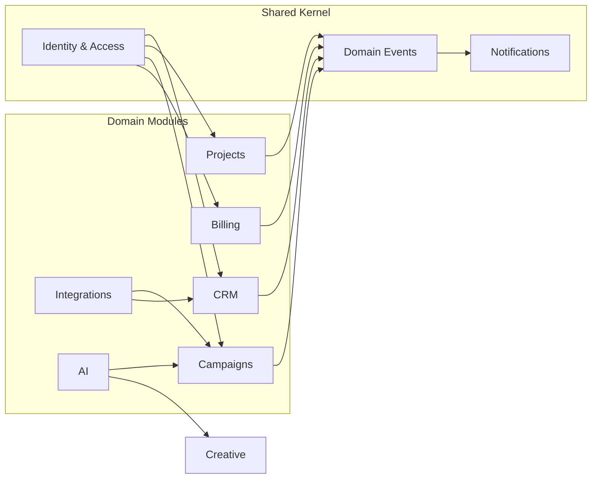
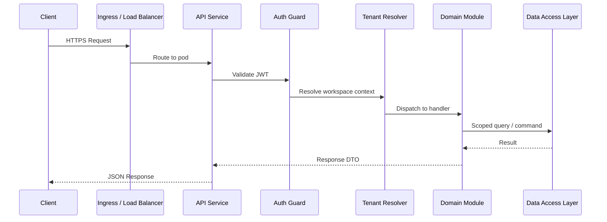
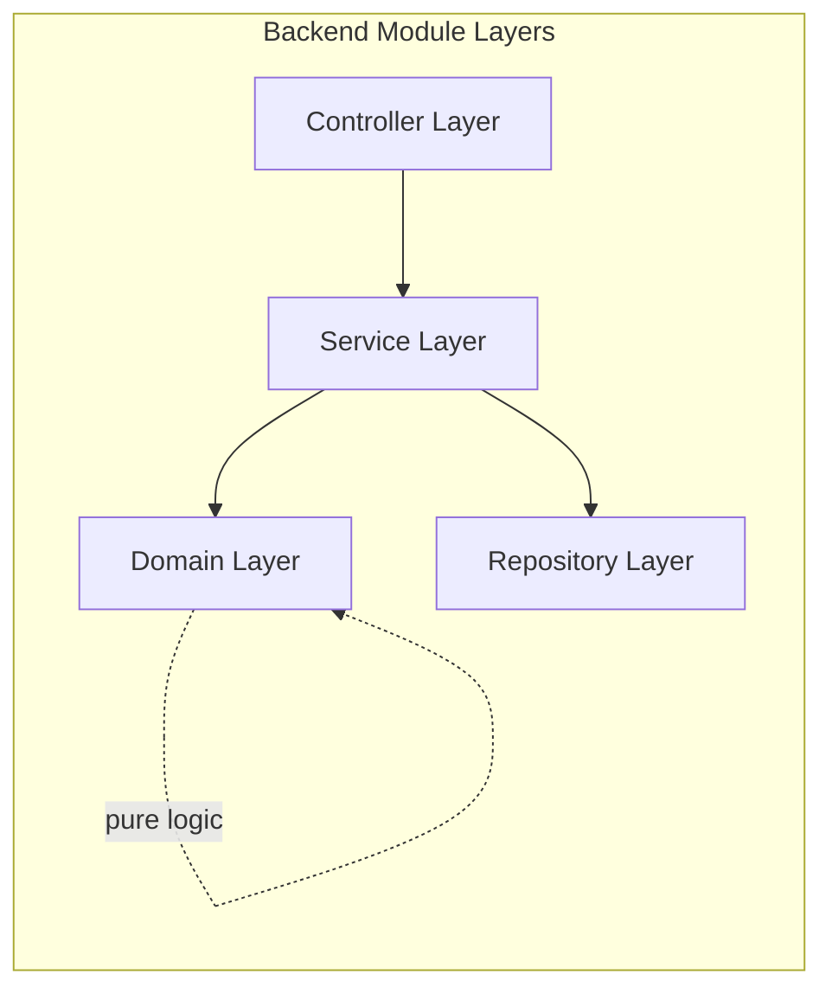
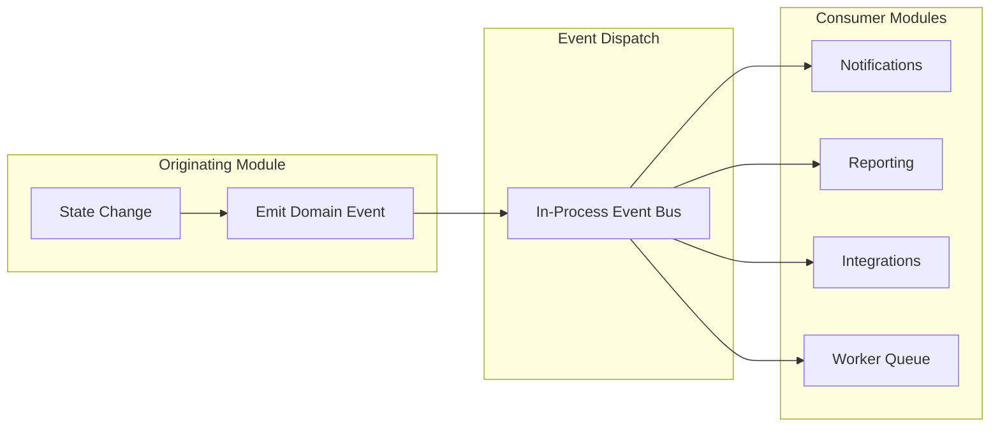
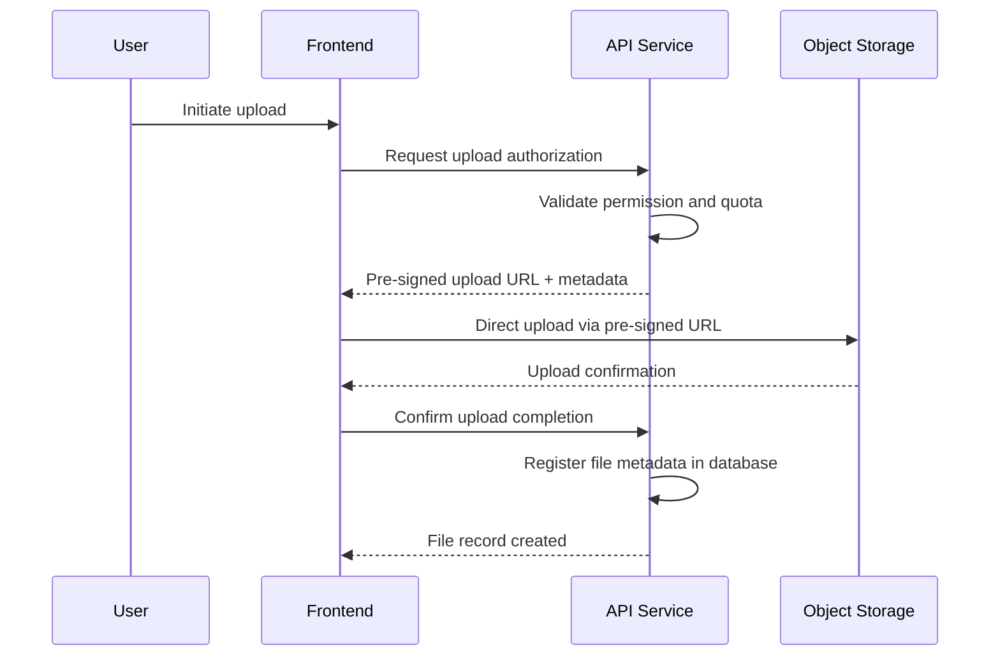
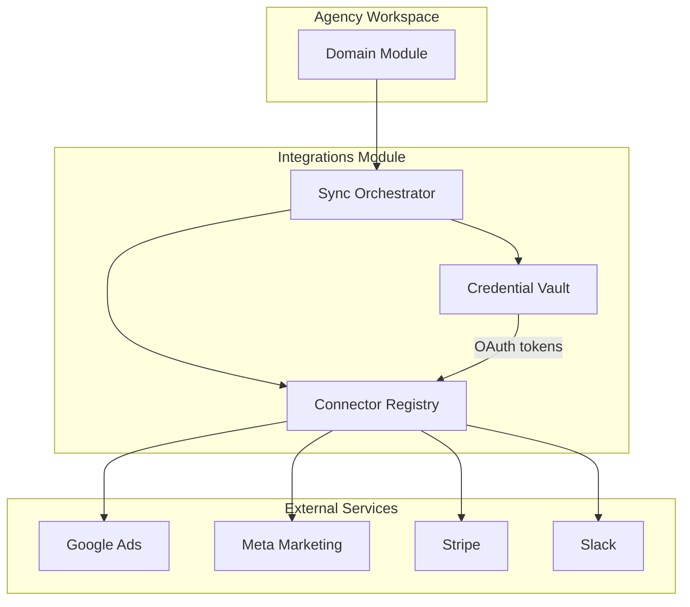
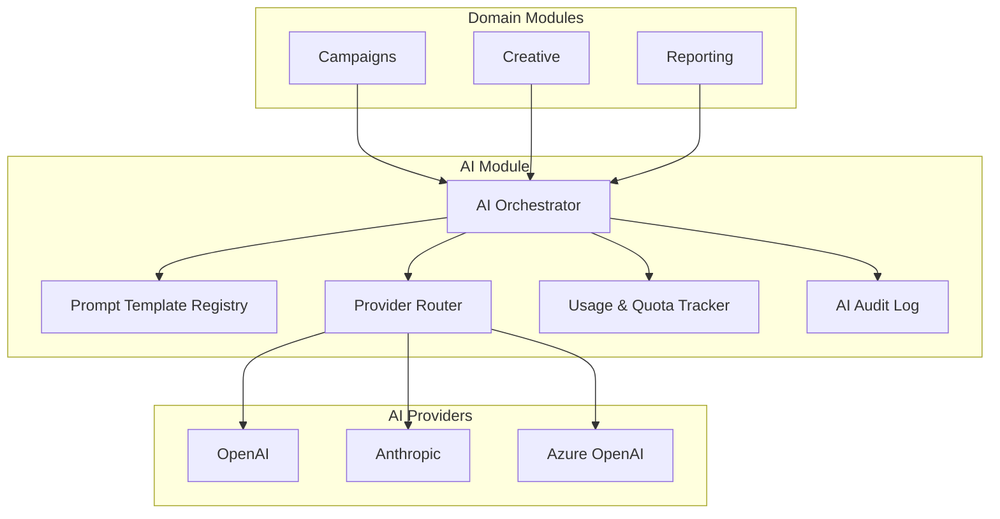
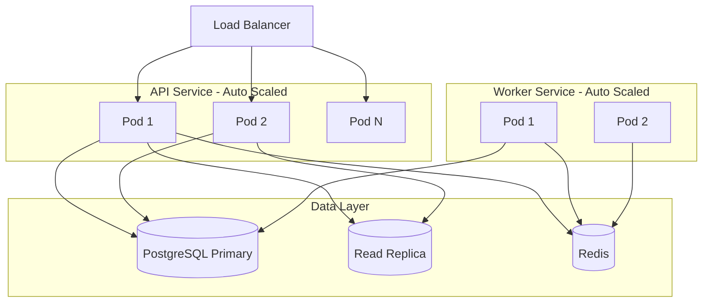

# AgencyOS Software Architecture

**Document ID:** `blueprint/03_ARCHITECTURE.md`  
**Status:** Approved  
**Last Updated:** 2026-06-28  
**Owner:** Engineering Architecture  
**Depends on:** [`blueprint/02_TECH_STACK.md`](02_TECH_STACK.md)

---

## 1. System Overview

AgencyOS is a **multi-tenant SaaS platform** that serves digital marketing agencies as a unified operating system. A single platform deployment hosts many isolated agency workspaces. Each workspace manages its own clients, campaigns, projects, team members, billing, and integrations without visibility into other agencies' data.

The system is composed of four primary runtime concerns:

| Concern | Responsibility |
|---------|----------------|
| **Presentation** | Web application delivering authenticated agency user experiences |
| **Application** | Business logic, authorization, orchestration, and domain rules |
| **Integration** | Connectors to external advertising, payment, communication, and AI services |
| **Platform** | Shared infrastructure services — identity, storage, queues, observability |

All persistent state flows through the application layer. The presentation layer holds no authoritative business data. External systems are accessed exclusively through integration adapters managed by the application layer.

AgencyOS follows a **modular monolith** backend architecture with a separately deployed frontend. This provides clear module boundaries and a path to service extraction without premature microservice complexity.

---

## 2. High-Level Architecture

The platform follows a classic **three-tier pattern** adapted for SaaS multi-tenancy:



**Request path:** The browser loads the presentation application, authenticates via the identity provider, and sends authenticated requests to the application tier. The application tier resolves tenant context, enforces authorization, executes domain logic, and reads or writes data through the data tier.

**Async path:** Long-running or scheduled operations — report generation, integration syncs, AI processing, email dispatch — are enqueued and handled by the worker service. The API returns immediately with a job reference or triggers fire-and-forget processing where appropriate.

**Deployment topology:** The presentation tier, API service, and worker service are independently scalable container workloads orchestrated per [Tech Stack §15](02_TECH_STACK.md#15-deployment-stack). Platform and data services are shared infrastructure across all tenants.

---

## 3. Multi-Tenant Architecture

AgencyOS uses a **shared database, shared schema** multi-tenancy model with **row-level tenant isolation**.

### Tenant Boundary

Every agency is a **tenant**. A tenant identifier is attached to all tenant-scoped resources at the data layer. The application layer enforces tenant scoping on every read and write operation — no query executes without an resolved tenant context.

### Isolation Guarantees

| Layer | Isolation Mechanism |
|-------|---------------------|
| **Authentication** | Users belong to one or more tenants; tokens carry tenant membership claims |
| **Authorization** | Role permissions are evaluated within tenant scope only |
| **Application** | Tenant context is resolved at request entry and propagated through all service calls |
| **Data** | All tenant-scoped records include a tenant identifier; cross-tenant access is structurally prevented |
| **Storage** | Object storage paths are namespaced by tenant identifier |
| **Cache** | Cache keys are prefixed with tenant identifier |
| **Integrations** | OAuth credentials and sync state are stored per tenant |
| **AI** | Provider configuration and usage quotas are scoped per tenant |

### Tenant Context Resolution

Tenant context is established once per request at the application boundary:

1. Authenticate the user via the identity provider (see [Tech Stack §8](02_TECH_STACK.md#8-authentication))
2. Resolve the active workspace from the request (URL segment, header, or session preference)
3. Verify the user holds membership in the resolved workspace
4. Attach tenant context to the request lifecycle for all downstream operations

Cross-tenant data access by platform administrators (support, billing operations) requires a separate elevated context with full audit logging.

### Tenant Lifecycle

| Phase | Behavior |
|-------|----------|
| **Provisioning** | New tenant created on agency signup; default roles, settings, and trial configuration applied |
| **Active** | Full platform access per subscription plan |
| **Suspended** | Read-only access; integrations paused; billing enforcement |
| **Deprovisioned** | Data export window, then scheduled purge per retention policy |

Tenant provisioning and lifecycle management are platform-level operations, not self-service destructive actions.

---

## 4. Workspace Model

A **workspace** is the user-facing representation of a tenant. Users experience AgencyOS through a workspace — it is the unit of navigation, branding, and collaboration.

### Workspace Characteristics

| Attribute | Description |
|-----------|-------------|
| **Identity** | Unique name, slug, and optional custom branding (logo, colors) |
| **Membership** | Users are invited to a workspace with a defined role |
| **Plan** | Subscription tier governs feature access, quotas, and integration limits |
| **Settings** | Timezone, currency, fiscal year, notification preferences |
| **Modules** | Feature modules enabled or disabled per plan |

### Multi-Workspace Users

A single user may belong to multiple workspaces (e.g., a freelancer working with multiple agencies, or an agency group with separate divisions). The user selects an **active workspace** after authentication. All subsequent operations occur within that workspace until the user switches context.

Workspace switching re-establishes tenant context without re-authentication. Authorization is re-evaluated against the target workspace membership.

### Workspace Hierarchy (Future)

The initial architecture supports flat workspaces. A future **organization → workspace** hierarchy (agency groups with sub-brands or regional offices) will extend the tenant model via an organization layer without changing the core isolation pattern. This extension will be documented via ADR when scoped.

---

## 5. Module Architecture

AgencyOS is organized into **domain modules**. Each module owns a bounded area of business capability, encapsulates its own domain logic, and exposes capabilities to other modules through defined internal interfaces.

### Core Modules

| Module | Domain Responsibility |
|--------|----------------------|
| **Identity & Access** | User profiles, workspace membership, role assignment, permission evaluation |
| **CRM** | Client accounts, contacts, leads, relationship history |
| **Projects** | Deliverables, tasks, milestones, time tracking, resource allocation |
| **Campaigns** | Campaign planning, channel configuration, performance tracking |
| **Creative** | Asset library, version management, approval workflows |
| **Reporting** | Dashboards, scheduled reports, data aggregation across modules |
| **Billing** | Subscriptions, invoicing, payment collection, usage metering |
| **Integrations** | Third-party connector management, sync orchestration, credential lifecycle |
| **AI** | Prompt orchestration, provider routing, output management, usage tracking |
| **Notifications** | In-app, email, and third-party alert delivery |
| **Admin** | Platform configuration, audit logs, tenant lifecycle, support tools |

### Module Interaction Rules



1. **Modules do not access another module's data store directly.** Cross-module data access flows through module service interfaces or domain events.
2. **Identity & Access** is a shared kernel module consumed by all others for authorization checks.
3. **Integrations** and **AI** are horizontal capability modules invoked by domain modules — they do not own core business entities.
4. **Notifications** is a consumer module — it reacts to domain events and does not initiate business state changes.
5. Each module defines its own internal layering (see §8) and may be extracted into an independent service in the future without changing external contracts.

### Module Boundaries and the Monolith

All modules deploy within a single backend application process (modular monolith). Module boundaries are enforced through:

- Package-level import restrictions (modules cannot import sibling module internals)
- Public service interfaces as the only cross-module entry points
- Shared types defined in a common contracts layer

This preserves development velocity while maintaining extraction readiness.

---

## 6. Frontend Architecture

The frontend is a server-rendered web application built on the stack defined in [Tech Stack §4](02_TECH_STACK.md#4-frontend-stack). It serves authenticated agency users exclusively — there is no public unauthenticated surface beyond marketing landing pages and the login flow.

### Architectural Layers

| Layer | Responsibility |
|-------|----------------|
| **Routes** | URL-to-view mapping, layout composition, authentication gates |
| **Features** | Self-contained UI modules aligned with backend domain modules |
| **Shared UI** | Design system components, layout primitives, form utilities |
| **Data Access** | API client, request caching, optimistic updates, error normalization |
| **Cross-Cutting** | Authentication state, workspace context, internationalization, telemetry |

### Rendering Strategy

| Context | Rendering Approach |
|---------|-------------------|
| **Authenticated app shell** | Server-rendered layout with client-hydrated interactive regions |
| **Dashboard and list views** | Server-rendered initial data with client-side pagination and filtering |
| **Forms and editors** | Client-rendered for rich interactivity |
| **Static content** | Static generation where content is invariant |

The frontend never holds secrets. Authentication tokens are managed through secure, HTTP-only mechanisms coordinated with the identity provider.

### Workspace-Aware Routing

All authenticated routes are scoped under a workspace identifier. Route guards enforce:

1. Valid authentication session
2. Active workspace membership
3. Module-level permission for the requested view

Unauthorized access attempts redirect to an appropriate fallback — login, workspace selector, or permission-denied view.

### Frontend–Backend Contract

The frontend consumes the backend exclusively through the REST API defined in the API blueprint. Shared TypeScript types are generated from the OpenAPI specification to maintain contract alignment (see [Tech Stack §10](02_TECH_STACK.md#10-api-technology)).

Real-time updates use WebSocket connections only for notification delivery and collaborative features — not as a general data transport.

---

## 7. Backend Architecture

The backend is the authoritative system for all business logic, authorization, and external orchestration, built on the stack defined in [Tech Stack §5](02_TECH_STACK.md#5-backend-stack).

### Service Topology

The backend deploys as two processes from the same codebase:

| Process | Role |
|---------|------|
| **API Service** | Synchronous request handling — REST endpoints, WebSocket connections, authentication validation |
| **Worker Service** | Asynchronous job processing — integration syncs, report generation, AI calls, email dispatch, scheduled tasks |

Both processes share domain modules, data access layers, and integration adapters. Only the API service receives external HTTP traffic.

### Request Lifecycle



Every inbound request passes through authentication validation and tenant resolution before reaching domain module handlers. Handlers contain no direct infrastructure concerns — persistence, caching, and external calls are delegated to inner layers.

### Domain Event Publishing

Domain modules emit events on significant state changes (client created, campaign launched, invoice paid). Events are published internally within the application process and consumed by:

- The **Notifications** module for user alerts
- The **Reporting** module for metric aggregation
- The **Integrations** module for outbound sync triggers
- The **Worker** service for async follow-up tasks

Events carry tenant context and are never published across tenant boundaries.

### Scheduled Operations

Recurring platform tasks — integration polling, report scheduling, data retention enforcement, usage metering — are registered as cron-triggered jobs in the worker service. Scheduled jobs execute with explicit tenant iteration or platform-level scope as appropriate.

---

## 8. Layered Architecture

Both frontend and backend modules follow a consistent **layered architecture** that enforces separation of concerns and testability.

### Backend Layer Model



| Layer | Responsibility | Rules |
|-------|---------------|-------|
| **Controller** | Request parsing, response formatting, input validation | No business logic; delegates to service layer |
| **Service** | Use case orchestration, transaction boundaries, authorization checks | Coordinates domain logic and repositories; one service method per use case |
| **Domain** | Entities, value objects, domain rules, invariants | Pure logic with no infrastructure dependencies |
| **Repository** | Data persistence and retrieval | Tenant-scoped queries only; no business logic |

Dependencies flow **inward** — outer layers depend on inner layers, never the reverse. The domain layer has zero dependencies on frameworks or infrastructure.

### Frontend Layer Model

| Layer | Responsibility | Rules |
|-------|---------------|-------|
| **Page / Route** | View composition, data loading orchestration | Thin — delegates to feature hooks and components |
| **Feature** | Feature-specific components, hooks, and local state | Self-contained; imports from shared UI and data access only |
| **Shared UI** | Reusable presentational components | No API calls; receives data via props |
| **Data Access** | API client functions, cache management | No UI logic; returns normalized data structures |

### Cross-Cutting Concerns

Concerns that span all layers are implemented as middleware, interceptors, or providers — not embedded in individual handlers:

- Authentication and tenant context propagation
- Structured logging and distributed tracing (see [Tech Stack §14](02_TECH_STACK.md#14-monitoring--logging))
- Rate limiting and request validation
- Error normalization and correlation ID assignment

---

## 9. Feature-Based Folder Strategy

The monorepo organizes code by **feature (domain module)**, not by technical type. Each feature is a vertical slice containing all layers required for that capability.

### Backend Feature Structure

Each backend module follows a consistent internal layout:

```
module-name/
├── controllers/       # Request handlers
├── services/          # Use case orchestration
├── domain/            # Entities, value objects, domain services
├── repositories/      # Data access
├── dto/               # Input/output data transfer objects
├── events/            # Domain event definitions and handlers
├── module.ts          # NestJS module registration
└── index.ts           # Public module interface (only export surface)
```

**Rules:**

- Cross-module imports are restricted to each module's `index.ts` public interface
- Shared utilities that serve multiple modules live in a `shared/` or `common/` package — not inside individual modules
- Integration adapters and AI orchestration live in their respective horizontal modules, not scattered across domain modules

### Frontend Feature Structure

Each frontend feature mirrors its backend counterpart:

```
features/
└── module-name/
    ├── components/    # Feature-specific UI components
    ├── hooks/         # Data fetching and state hooks
    ├── pages/         # Route-level view compositions
    ├── types/         # Feature-specific type extensions
    └── index.ts       # Public feature exports
```

Shared resources live outside features:

- `components/ui/` — design system primitives
- `lib/api/` — generated API client and request utilities
- `lib/auth/` — authentication and workspace context providers

### Naming Alignment

Frontend feature names map one-to-one with backend module names. This alignment reduces cognitive overhead and simplifies tracing a capability from UI to API to data layer.

---

## 10. State Management

AgencyOS separates state into distinct categories with explicit ownership and lifecycle rules.

### State Categories

| Category | Owner | Scope | Examples |
|----------|-------|-------|---------|
| **Server state** | Backend (authoritative) | Persistent, tenant-scoped | Clients, campaigns, invoices, user profiles |
| **Client cache** | Frontend (derived) | Session-scoped, invalidated on mutation | List views, detail pages, dashboard metrics |
| **UI state** | Frontend (ephemeral) | Component or feature-scoped | Modal open/close, form drafts, tab selection |
| **Session state** | Identity provider + frontend | Authentication session | User identity, active workspace, token lifecycle |
| **Real-time state** | Backend via WebSocket push | Event-driven updates | Unread notification count, live collaboration cursor |

### State Flow Principles

1. **Single source of truth** — The backend owns all business state. The frontend cache is a read-optimized projection, never an authority.
2. **Optimistic updates with reconciliation** — UI may reflect expected state immediately on mutation, but always reconciles against the server response.
3. **Cache invalidation on mutation** — Any successful write operation invalidates affected cache entries. Stale data is never silently displayed after a known mutation.
4. **No global client store for server data** — Server state is managed through a request-cache library with declarative invalidation, not a global mutable store.
5. **Workspace context is ambient** — Active workspace is available through a React context provider. All data access hooks implicitly scope requests to the active workspace.
6. **Form drafts are local** — Unsaved form state lives in component-local state or session storage. It is never persisted to the server until explicitly submitted.

### Backend State

The backend maintains no session state between requests beyond what is stored in Redis for caching and rate limiting (see [Tech Stack §6](02_TECH_STACK.md#6-database)). Each request is stateless — tenant context and user identity are reconstructed from the JWT on every invocation.

Long-running process state (job progress, sync status) is persisted in PostgreSQL and surfaced to the frontend via polling or push notifications.

---

## 11. Event Flow

AgencyOS uses an **event-driven internal architecture** for cross-module communication. Events decouple modules while preserving auditability and enabling async processing.

### Event Types

| Type | Scope | Delivery | Examples |
|------|-------|----------|---------|
| **Domain events** | Internal to backend | Synchronous in-process dispatch | Client created, task completed, payment received |
| **Integration events** | Backend → external systems | Async via worker queue | Sync client to CRM connector, push conversion to ad platform |
| **Notification events** | Backend → frontend | Async via WebSocket or polling | New mention, approval request, sync failure alert |
| **Scheduled events** | Worker → backend modules | Cron-triggered | Nightly report generation, integration polling, data cleanup |

### Domain Event Flow



### Event Contract Rules

1. **Events are immutable facts** — They describe something that already happened, named in past tense (`ClientCreated`, not `CreateClient`).
2. **Events carry tenant context** — Every event includes the tenant identifier and acting user.
3. **Events are idempotent at the consumer** — Handlers must tolerate duplicate delivery without side effects.
4. **Events do not chain synchronously** — A handler may emit a new event, but must not call another module's service directly from an event handler.
5. **Failed async event processing is retried** — Worker queue jobs use exponential backoff with dead-letter queuing for manual investigation.

### Audit Trail

All domain events contributing to business-critical state changes are recorded in an immutable audit log. The audit log is queryable by platform administrators and agency owners for compliance and dispute resolution.

---

## 12. File Storage Architecture

File storage follows the object storage model defined in [Tech Stack §9](02_TECH_STACK.md#9-storage). Files never reside on application server filesystems.

### Storage Namespacing

All objects are organized under a tenant-scoped namespace:

```
/{tenant-id}/{module}/{resource-type}/{resource-id}/{filename}
```

This structure enforces tenant isolation at the storage layer and enables per-tenant lifecycle policies, access audits, and bulk export.

### Upload Flow



1. The frontend requests upload authorization from the API
2. The API validates permissions, checks storage quota, and generates a pre-signed upload URL
3. The frontend uploads directly to object storage — file bytes never pass through the API
4. On completion, the frontend notifies the API to register file metadata
5. The API stores metadata in PostgreSQL; the object store holds the binary content

### Access Control

| Operation | Authorization |
|-----------|--------------|
| **Upload** | Module-level write permission + quota check |
| **Download** | Module-level read permission; pre-signed download URL with short expiry |
| **Delete** | Module-level delete permission; soft-delete with scheduled purge |
| **Public access** | Disabled by default; CDN-served assets require explicit publish action |

### Asset Lifecycle

| Stage | Behavior |
|-------|----------|
| **Active** | Available for download and reference within the platform |
| **Archived** | Moved to infrequent-access storage tier; retrievable on request |
| **Purged** | Permanently deleted on tenant deprovisioning or retention policy expiry |

Creative assets in the **Creative** module may have version history — each version is a separate object under the same resource path with version metadata tracked in the application layer.

---

## 13. Integration Architecture

External integrations follow a **connector-based architecture** managed by the Integrations module. Connectors are backend-only — the frontend interacts with integration state through standard domain APIs, never directly with third-party services.

### Connector Model



Each external service is represented by a **connector** — a self-contained adapter implementing a standard connector interface:

| Interface Method | Purpose |
|-----------------|---------|
| **Authenticate** | OAuth flow initiation and token exchange |
| **Validate** | Verify stored credentials are still valid |
| **Pull** | Fetch data from external system into AgencyOS |
| **Push** | Send AgencyOS data to external system |
| **Webhook** | Handle inbound webhook events from external system |

### Sync Strategies

| Strategy | Use Case |
|----------|----------|
| **Real-time webhook** | External system pushes changes on event (preferred where supported) |
| **Polling** | Worker cron job fetches changes on interval (fallback for APIs without webhooks) |
| **On-demand** | User-triggered sync from the UI |
| **Event-driven** | Domain event in AgencyOS triggers outbound push to connected service |

### Credential Management

Integration credentials (OAuth tokens, API keys) are stored in the secrets manager defined in [Tech Stack §15](02_TECH_STACK.md#15-deployment-stack). Connectors retrieve credentials at runtime through a credential vault service — credentials are never logged, cached in application memory beyond request scope, or exposed to the frontend.

Token refresh is handled automatically by the connector layer. Expired or revoked credentials surface as integration health alerts to the agency administrator.

### Error Handling and Resilience

- Failed sync operations are retried with exponential backoff
- Persistent failures are recorded with error context and surfaced in the integration health dashboard
- Rate limits imposed by external APIs are respected through centralized throttling in the orchestrator
- All integration activity is logged for audit and debugging

---

## 14. AI Architecture

AI capabilities follow the provider strategy defined in [Tech Stack §11](02_TECH_STACK.md#11-ai-provider-strategy). AI is a **horizontal platform capability** — domain modules invoke AI services through a centralized orchestration layer, never calling providers directly.

### AI Service Layers



| Component | Responsibility |
|-----------|---------------|
| **AI Orchestrator** | Single entry point for all AI requests; validates permissions, assembles context, dispatches to provider |
| **Prompt Template Registry** | Versioned, tenant-configurable prompt templates with variable substitution |
| **Provider Router** | Selects provider based on tenant configuration, task type, cost controls, and data residency rules |
| **Usage & Quota Tracker** | Records token consumption per tenant; enforces plan-based limits |
| **AI Audit Log** | Immutable record of all AI requests and responses for compliance review |

### Request Flow

1. Domain module submits an AI request with a template identifier and context variables
2. Orchestrator validates the requesting user has permission and the tenant is within quota
3. Prompt template is resolved and rendered with context variables
4. Provider router selects the appropriate provider and model
5. Request is dispatched asynchronously via the worker queue for long operations, or synchronously for quick completions
6. Response is returned to the originating module; audit log and usage metrics are recorded

### Data Handling

- Client PII and confidential campaign data are classified before inclusion in AI context
- Data residency requirements route requests to region-appropriate providers (e.g., Azure OpenAI for EU tenants)
- AI outputs are stored as domain entities (draft content, analysis results) — not as raw provider responses
- Users must explicitly accept AI-generated content before it becomes authoritative business data

---

## 15. Scalability Strategy

AgencyOS is designed to scale horizontally from initial launch through enterprise agency adoption.

### Scaling Dimensions

| Dimension | Strategy |
|-----------|----------|
| **Tenant count** | Shared infrastructure scales linearly; tenant isolation is logical, not physical |
| **Users per tenant** | API service horizontal pod autoscaling based on request rate and latency |
| **Data volume** | PostgreSQL read replicas for reporting queries; table partitioning for high-volume modules |
| **File storage** | Object storage scales infinitely; CDN offloads delivery bandwidth |
| **Integration sync** | Worker service scales independently; per-connector rate limiting prevents thundering herd |
| **AI processing** | Worker queue absorbs burst demand; per-tenant concurrency limits prevent provider overload |
| **Background jobs** | Redis-backed queue with configurable worker pool size per job type |

### Horizontal Scaling Topology



### Performance Boundaries

| Concern | Mitigation |
|---------|-----------|
| **Hot tenant** | Per-tenant rate limiting; noisy-neighbor detection via usage metrics |
| **Large report generation** | Async worker processing with progress tracking; result caching |
| **Bulk integration sync** | Chunked processing with checkpointing; staggered scheduling across tenants |
| **Complex dashboard queries** | Pre-aggregated metrics tables; read replica routing; response caching with TTL |

### Scaling Triggers

Kubernetes Horizontal Pod Autoscaler monitors CPU utilization, memory, and custom metrics (request latency p95, queue depth) to scale API and worker pods. Database scaling follows a manual upgrade path — instance sizing, read replica addition, and connection pool tuning — documented in the infrastructure runbook.

Module extraction into independent services is the long-term scaling path when individual modules develop independent scaling profiles or deployment cadences. The modular monolith boundary design (§5, §9) preserves this option without upfront microservice overhead.

---

## 16. Disaster Recovery Overview

AgencyOS maintains business continuity through layered recovery strategies aligned with the infrastructure defined in [Tech Stack §7](02_TECH_STACK.md#7-infrastructure) and [Tech Stack §15](02_TECH_STACK.md#15-deployment-stack).

### Recovery Objectives

| Tier | RTO | RPO | Scope |
|------|-----|-----|-------|
| **Tier 1 — Platform** | ≤ 1 hour | ≤ 5 minutes | API availability, authentication, core CRM and project access |
| **Tier 2 — Integrations** | ≤ 4 hours | ≤ 1 hour | External syncs, AI processing, report generation |
| **Tier 3 — Analytics** | ≤ 24 hours | ≤ 4 hours | Historical reporting, audit log queries, archived assets |

### Backup Strategy

| Component | Backup Method | Frequency | Retention |
|-----------|--------------|-----------|-----------|
| **PostgreSQL** | Automated snapshots + continuous WAL archiving | Continuous + daily snapshot | 30 days rolling |
| **Object storage** | Cross-region replication + versioning | Continuous | Per tenant lifecycle policy |
| **Redis** | Not backed up (ephemeral); rebuilt from PostgreSQL on recovery | — | — |
| **Secrets** | Managed by secrets manager with automatic rotation | On change | Version history |
| **Infrastructure config** | Terraform state in remote backend with versioning | On every apply | Full history |

### Failure Scenarios

| Scenario | Response |
|----------|----------|
| **Single pod failure** | Kubernetes restarts pod; load balancer routes around unhealthy instances |
| **Availability zone outage** | Multi-AZ deployment; traffic rerouted to healthy zones automatically |
| **Database primary failure** | Automated failover to standby replica; connection pool reconnect |
| **Region-wide outage** | Manual failover to DR region using cross-region database replica and storage replication |
| **Data corruption** | Point-in-time recovery from WAL archives to pre-corruption timestamp |
| **Tenant data deletion (accidental)** | Soft-delete with 30-day recovery window before permanent purge |

### DR Testing

Disaster recovery procedures are tested quarterly through tabletop exercises and annually through a full failover drill in the staging environment. Recovery runbooks are maintained in the infrastructure documentation.

---

## 17. Architecture Principles

These principles govern all architectural decisions in AgencyOS. They extend the technology selection principles in [Tech Stack §3](02_TECH_STACK.md#3-technology-selection-principles) with system design-specific guidance.

| # | Principle | Description |
|---|-----------|-------------|
| 1 | **Backend authority** | The backend is the single source of truth for business state, authorization, and integration orchestration. The frontend is a presentation and interaction layer. |
| 2 | **Tenant isolation by default** | Every operation assumes tenant scope unless explicitly elevated. Cross-tenant access requires platform-level authorization and audit logging. |
| 3 | **Module autonomy** | Domain modules own their logic and data access. Cross-module interaction flows through public interfaces or domain events — never through shared database queries. |
| 4 | **Fail closed** | Authentication failures, authorization denials, and validation errors reject the request. The system never degrades to unauthenticated or cross-tenant access on error. |
| 5 | **Async by default for slow paths** | Operations exceeding 500ms expected latency (AI, reports, bulk syncs, email) are processed asynchronously via the worker queue. |
| 6 | **Idempotent operations** | All mutation endpoints and event handlers are designed for safe retry. External integration calls use idempotency keys. |
| 7 | **Observability everywhere** | Every service emits structured logs, metrics, and traces. Every request carries a correlation ID from ingress to data layer. |
| 8 | **Secure by design** | Secrets never appear in code, logs, or frontend bundles. All external communication uses TLS. All uploads use pre-signed URLs. |
| 9 | **Extraction readiness** | Module boundaries, public interfaces, and event contracts are designed so any module can become an independent service without rewriting consumers. |
| 10 | **Simplicity over cleverness** | Prefer the modular monolith, synchronous in-process events, and REST API until measured scale or team structure demands otherwise. Complexity requires ADR justification. |

### Decision Framework

When evaluating an architectural change, apply these principles in order:

1. Does it maintain tenant isolation?
2. Does it preserve module boundaries?
3. Does it align with the finalized technology stack?
4. Is it the simplest approach that meets the requirement?
5. If it adds complexity, is there an ADR documenting the trade-off?

---

*This document defines system architecture. For technology choices, refer to [`blueprint/02_TECH_STACK.md`](02_TECH_STACK.md). For data modeling, refer to the Database blueprint. For API contracts, refer to the API blueprint.*
